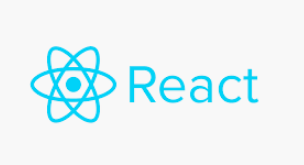
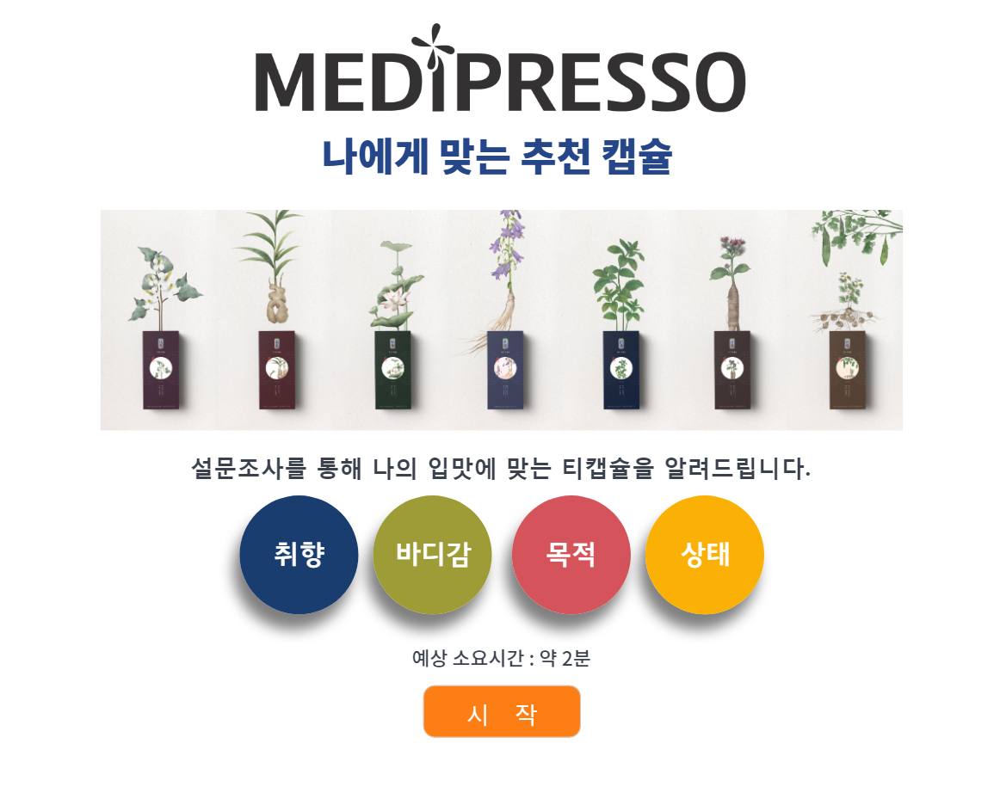
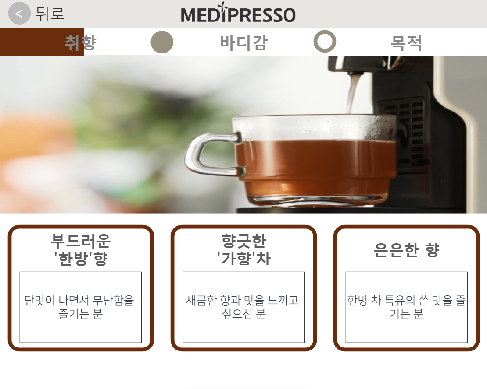
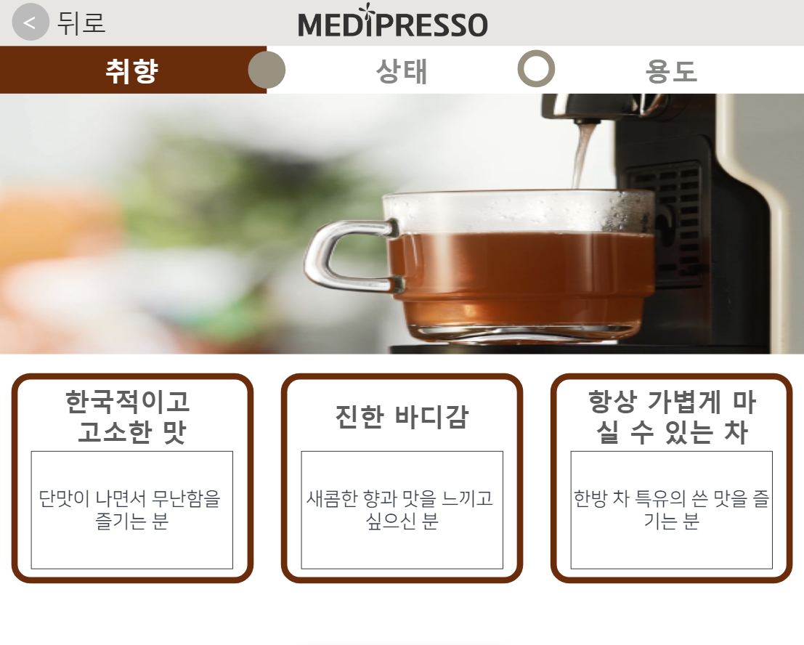
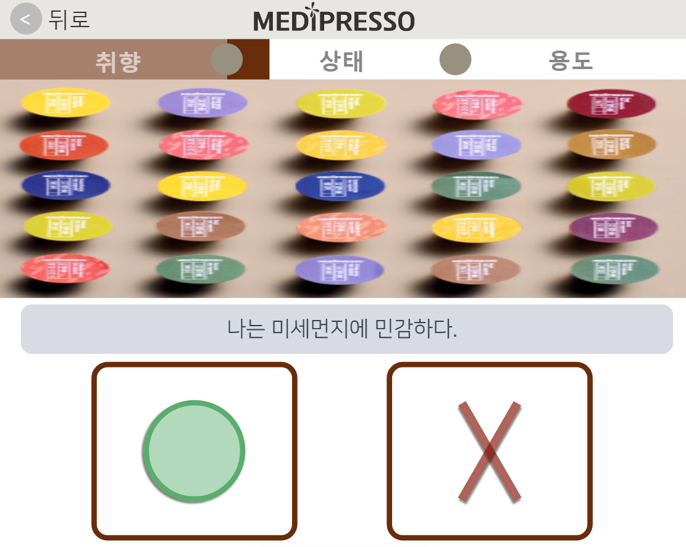
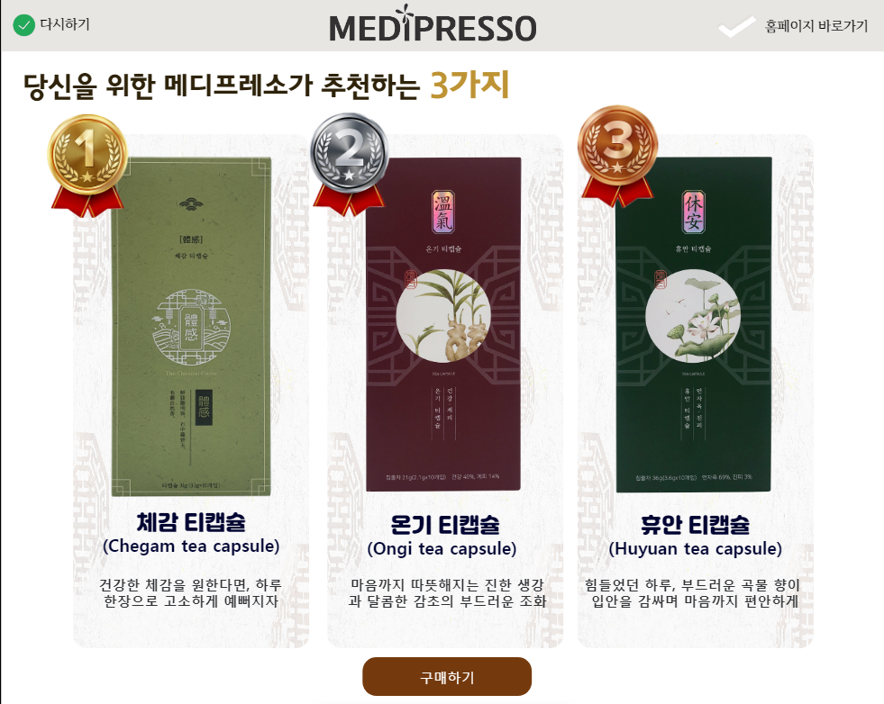

</img> 

# react js와 node js를 이용한 설문조사 웹페이지 

추천 제품을 얻기 위한 제품 추천 설문조사 페이지를 제작하여 선택에 따른 제품 점수를 부여, 제품 중 점수가 높은 3가지를 추천

***

# 개발환경 

* react js

* node js

***

# 기능 소개

1. 메인 페이지   

 

2. 설문 선택 페이지   

 
 
 

3. 최종 추천 페이지(작업중)   

  

***

# 코드 소개 

* Mainpage.js 

첫 메인 화면이며, Template라는  components를 통해 나타냄

* Poll.js 

설문 부분으로 원하는 취향 선택 

* Poll_page_2.js

상단은 poll_template.js로 표현하고 

* True_button.js   

O/X 페이지를 제작 
